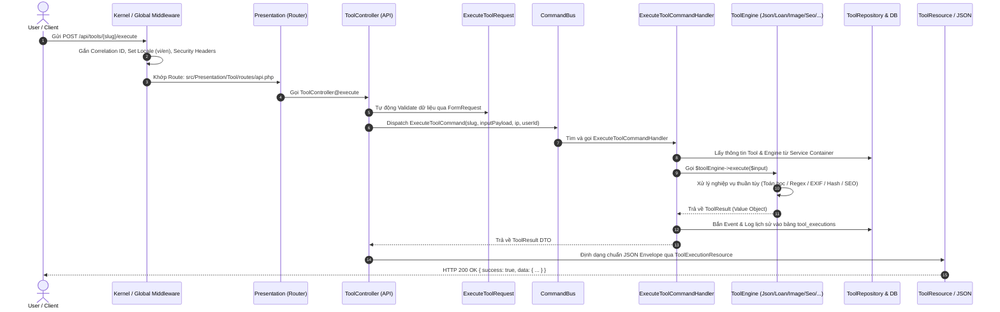

# 🧭 Deep-Dive: Vòng Đời Thực Thi (Execution Lifecycle) & Cấu Trúc Mã Nguồn `/src`

> **Tài liệu chuẩn Senior** dành cho Backend Engineers, Fullstack Developers và Software Architects để nắm bắt tường tận luồng dữ liệu (Data Flow), cơ chế điều phối và cách thức hoạt động của từng tệp mã nguồn bên trong thư mục `/src`.

---

## 🏛️ 1. Bản Đồ Tổng Quan Cấu Trúc Thư Mục `/src`

Dự án **TechHub** áp dụng triệt để kiến trúc **Clean Architecture kết hợp DDD & CQRS**. Mã nguồn nghiệp vụ nằm toàn bộ trong `/src`, được chia tách thành 5 tầng độc lập tuân thủ quy tắc phụ thuộc một chiều (**Dependency Rule**):

```
src/
├── Domain/                         # 🟢 [Core] Trọng tâm nghiệp vụ thuần túy (Không phụ thuộc Framework)
│   ├── Tool/                       # Bounded Context: Công cụ trực tuyến
│   │   ├── Contracts/              # ToolContract, ToolRepositoryContract
│   │   ├── Entities/               # Tool, ToolCategory, ToolExecution (Eloquent Domain Models)
│   │   ├── Enums/                  # ToolEngineType, ExecutionStatus
│   │   ├── Tools/                  # 19 Engine xử lý nghiệp vụ toán học, code, ảnh, SEO Onpage
│   │   │   ├── Developer/          # JsonFormatter, Base64, Hash, Jwt, Regex, Url, ProxyChecker (7 tools)
│   │   │   ├── Calculators/        # Loan, Percentage, Bmi (3 tools)
│   │   │   ├── Image/              # ImageColorExtractor, ImageMetadata (2 tools)
│   │   │   └── Seo/                # SerpPreview, MetaTag, Schema, OpenGraph, Robots, Sitemap, Slug (7 tools)
│   │   └── ValueObjects/           # ToolResult, CategorySlug
│   ├── User/                       # Bounded Context: Người dùng & Phân quyền
│   ├── Setting/                    # Bounded Context: Cấu hình động & Text hệ thống
│   └── Ad/                         # Bounded Context: Quảng cáo & Banner
│
├── Application/                    # 🔵 [Use Cases] Điều phối nghiệp vụ, CQRS Commands/Queries
│   ├── Bus/                        # IlluminateCommandBus, IlluminateQueryBus
│   ├── Tool/                       # Commands: ExecuteToolCommand & Handler
│   ├── Setting/                    # SettingService (Tầng Cache + Invalidation)
│   └── Ad/                         # AdService (Truy vấn vị trí Slot & Tracking click)
│
├── Infrastructure/                 # 🟡 [Adapters] Hiện thực hóa Repository & Tích hợp ngoài
│   ├── Tool/
│   │   ├── Providers/              # ToolServiceProvider (Đăng ký 19 Tool Engine vào Container)
│   │   └── Repositories/           # EloquentToolRepository (Hiện thực ToolRepositoryContract)
│   └── Persistence/                # Database Migrations & Schemas
│
├── Presentation/                   # 🔴 [Delivery Mechanism] Tầng giao tiếp người dùng
│   ├── Tool/
│   │   ├── Controllers/            # ToolController (REST API), ToolWebController (Blade SSR)
│   │   ├── Requests/               # ExecuteToolRequest (Validate đầu vào)
│   │   ├── Resources/              # ToolResource, ToolCategoryResource (Chuẩn JSON Envelope)
│   │   └── routes/                 # api.php, web.php của Module Tool
│   ├── Admin/                      # Bộ điều khiển quản trị viên
│   │   ├── Controllers/            # Auth, Dashboard, Users, Tools, Ads, Settings
│   │   ├── Middleware/             # AdminMiddleware (Kiểm tra Role & Strict Status)
│   │   └── routes/                 # web.php của Admin Panel (/admin/*)
│   └── Controller.php              # Base Abstract Controller
│
└── Shared/                         # 🟣 [Cross-Cutting] Tài nguyên dùng chung cho mọi tầng
    ├── Contracts/                  # CommandBusContract, QueryBusContract
    ├── Enums/                      # Environment, OrderDirection
    ├── Infrastructure/Http/
    │   └── Middleware/             # SetLocaleMiddleware, SecurityHeadersMiddleware, CorrelationId
    └── Traits/                     # HasUlid, ApiResponse
```

---

## 🔁 2. Chi Tiết Vòng Đời Thực Thi Của Một Request (Request Lifecycle)

Hãy cùng mổ xẻ hành trình của một request khi gửi đến TechHub từ lúc vào Router cho đến khi trả về kết quả cho trình duyệt / client:



---

## 🔍 3. Mổ Xẻ Chi Tiết 5 Kịch Bản Thực Thi Thực Tế

### Kịch Bản 1: Thực Thi Công Cụ Qua REST API (`POST /api/tools/{slug}/execute`)

1. **Khởi nguồn Request**:
   * Client (Frontend JavaScript hoặc ứng dụng Mobile bên thứ ba) gửi yêu cầu POST đến `/api/tools/loan-calculator/execute` kèm JSON payload:
     ```json
     { "input": { "principal": 500000000, "annual_interest_rate": 8.5, "term_months": 60 } }
     ```
2. **Tầng Presentation**:
   * Route được định nghĩa tại [`src/Presentation/Tool/routes/api.php`](file:///e:/Project_ItWebDev/PHP/techhub/src/Presentation/Tool/routes/api.php).
   * Request đi qua [`ExecuteToolRequest.php`](file:///e:/Project_ItWebDev/PHP/techhub/src/Presentation/Tool/Requests/ExecuteToolRequest.php) để kiểm tra tính hợp lệ cơ bản.
   * [`ToolController.php`](file:///e:/Project_ItWebDev/PHP/techhub/src/Presentation/Tool/Controllers/ToolController.php) nhận request và đóng gói thành [`ExecuteToolCommand`](file:///e:/Project_ItWebDev/PHP/techhub/src/Application/Tool/Commands/ExecuteToolCommand.php).
3. **Tầng Application (CQRS Command Bus)**:
   * [`IlluminateCommandBus`](file:///e:/Project_ItWebDev/PHP/techhub/src/Application/Bus/IlluminateCommandBus.php) điều phối Command đến [`ExecuteToolCommandHandler`](file:///e:/Project_ItWebDev/PHP/techhub/src/Application/Tool/CommandHandlers/ExecuteToolCommandHandler.php).
   * Handler kiểm tra cờ `is_active` của công cụ.
4. **Tầng Domain (Nghiệp Vụ Thuần)**:
   * Handler lấy Engine tương ứng đã được đăng ký trong [`ToolServiceProvider.php`](file:///e:/Project_ItWebDev/PHP/techhub/src/Infrastructure/Tool/Providers/ToolServiceProvider.php) (Ví dụ: `LoanCalculatorTool`).
   * Engine kiểm tra `validationRules()` riêng và thực thi thuật toán Equated Monthly Installment (EMI), tính lãi giảm dần, sinh lịch trả nợ.
   * Engine trả về đối tượng bất biến [`ToolResult`](file:///e:/Project_ItWebDev/PHP/techhub/src/Domain/Tool/ValueObjects/ToolResult.php).
5. **Ghi nhận Lịch Sử & Phản hồi**:
   * Handler tự động tăng `execution_count` trên Entity và lưu lịch sử chạy vào `tool_executions`.
   * Controller trả về chuẩn Envelope `{ success: true, data: { ... } }`.

---

### Kịch Bản 2: Truy Cập Giao Diện Công Cụ (`GET /tools/{slug}`)

1. **Routing**:
   * Route được định nghĩa tại [`src/Presentation/Tool/routes/web.php`](file:///e:/Project_ItWebDev/PHP/techhub/src/Presentation/Tool/routes/web.php).
2. **Controller**:
   * [`ToolWebController.php`](file:///e:/Project_ItWebDev/PHP/techhub/src/Presentation/Tool/Controllers/ToolWebController.php) gọi `ToolRepositoryContract` để truy vấn công cụ theo `slug`.
   * Tự động lấy danh sách 5 công cụ liên quan (`relatedTools`) trong cùng chuyên mục.
3. **Render Blade & SEO**:
   * View [`resources/views/pages/tools/show.blade.php`](file:///e:/Project_ItWebDev/PHP/techhub/resources/views/pages/tools/show.blade.php) được render kèm:
     * Dữ liệu cấu trúc **Schema.org JSON-LD** (`SoftwareApplication`, `BreadcrumbList`).
     * Thẻ SEO song ngữ `hreflang`.
     * Form nhập liệu chuyên biệt cho từng công cụ.
     * Container đồ họa trực quan (Rich Output) kết hợp `techhub.js`.

---

### Kịch Bản 3: Quản Trị Hệ Thống Admin Panel (`/admin/*`)

1. **Bảo vệ bằng Middleware**:
   * Mọi route bắt đầu bằng `/admin` (ngoại trừ `/admin/login`) đều phải vượt qua [`AdminMiddleware.php`](file:///e:/Project_ItWebDev/PHP/techhub/src/Presentation/Admin/Middleware/AdminMiddleware.php).
   * Middleware kiểm tra `Auth::check()`, role là `admin` và tài khoản ở trạng thái `UserStatus::Active`.
2. **Strict Lazy Loading Guard**:
   * Khi Admin xem Dashboard, [`AdminDashboardController.php`](file:///e:/Project_ItWebDev/PHP/techhub/src/Presentation/Admin/Controllers/AdminDashboardController.php) bắt buộc phải sử dụng Eager Loading (`with('category')`, `with('tool')`).
   * Nếu có bất kỳ câu truy vấn N+1 nào, `Model::preventLazyLoading` sẽ lập tức cảnh báo.
3. **Cập nhật Cấu hình & Invalidation Cache tức thì**:
   * Khi Admin sửa text động tại `/admin/settings`, [`AdminSettingController.php`](file:///e:/Project_ItWebDev/PHP/techhub/src/Presentation/Admin/Controllers/AdminSettingController.php) gọi [`SettingService::set()`](file:///e:/Project_ItWebDev/PHP/techhub/src/Application/Setting/Services/SettingService.php).
   * Service cập nhật CSDL đồng thời gọi `Cache::forget('system_setting_...')` để toàn bộ trang chủ nhận nội dung mới ngay tức khắc mà không cần khởi động lại server.

---

### Kịch Bản 4: Sinh XML Sitemap Động Chuẩn SEO (`GET /sitemap.xml`)

1. Route `GET /sitemap.xml` được tiếp nhận bởi `ToolWebController@sitemap`.
2. Controller truy vấn toàn bộ các công cụ đang hoạt động (`is_active = true`), danh mục và các trang tĩnh.
3. Sinh cấu trúc XML chuẩn `sitemaps.org/schemas/sitemap/0.9` kèm các thẻ `<xhtml:link rel="alternate" hreflang="vi/en">`.
4. Trả về HTTP Response với Header `Content-Type: application/xml`.

---

## 🎯 4. Quy Tắc Lập Trình Khi Thêm Công Cụ Mới (Extending New Tools)

Để bổ sung một công cụ mới vào hệ thống chuẩn Senior, một Developer chỉ cần thực hiện 3 bước đơn giản:

### Bước 1: Tạo Engine Nghiệp Vụ trong `src/Domain/Tool/Tools/`
Tạo một Class mới implement `ToolContract`:

```php
namespace Domain\Tool\Tools\Developer;

use Domain\Tool\Contracts\ToolContract;
use Domain\Tool\Enums\ToolEngineType;
use Domain\Tool\ValueObjects\ToolResult;

class MyNewTool implements ToolContract
{
    public function slug(): string { return 'my-new-tool'; }
    public function name(): string { return 'Tên Công Cụ Mới'; }
    public function categorySlug(): string { return 'developer'; }
    public function summary(): string { return 'Mô tả ngắn...'; }
    public function engineType(): ToolEngineType { return ToolEngineType::ServerSync; }
    
    public function validationRules(): array
    {
        return ['input_data' => ['required', 'string']];
    }

    public function execute(array $input): ToolResult
    {
        $start = hrtime(true);
        // Xử lý logic thuần...
        $duration = (int) round((hrtime(true) - $start) / 1e6);
        return ToolResult::success(['result' => 'Dữ liệu đã xử lý'], $duration);
    }
}
```

### Bước 2: Đăng ký Engine vào `ToolServiceProvider`
Trong file [`src/Infrastructure/Tool/Providers/ToolServiceProvider.php`](file:///e:/Project_ItWebDev/PHP/techhub/src/Infrastructure/Tool/Providers/ToolServiceProvider.php), thêm class vào mảng `$tools`:

```php
protected array $tools = [
    // ... các tool cũ
    \Domain\Tool\Tools\Developer\MyNewTool::class,
];
```

### Bước 3: Thêm UI Form và Rich Visual Renderer (Tùy chọn)
1. Thêm khối `@elseif($tool->slug === 'my-new-tool')` trong [`resources/views/pages/tools/show.blade.php`](file:///e:/Project_ItWebDev/PHP/techhub/resources/views/pages/tools/show.blade.php).
2. Thêm hàm vẽ đồ họa trong hàm `renderRichOutput()` tại [`public/js/techhub.js`](file:///e:/Project_ItWebDev/PHP/techhub/public/js/techhub.js).

---

## 🏆 5. Tổng Kết Giá Trị Kiến Trúc

* **Decoupled 100%**: Domain không dính dáng đến Controller hay Database. Thuật toán có thể đem chạy ở Console CLI, Queue Worker hoặc gán vào REST API mà không sửa 1 dòng code.
* **Testable 100%**: Dễ dàng viết Unit Test cho từng Engine mà không cần khởi động Database hay HTTP Server.
* **Zero N+1 Query**: Nghiêm ngặt với Eager Loading, kiểm soát toàn diện qua Pest Architecture Tests.
