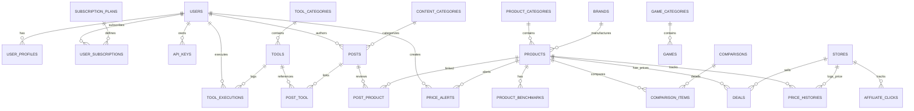

# 🗄️ 03. Thiết Kế Cơ Sở Dữ Liệu Toàn Diện (Senior Database Architecture & Schema)

Tài liệu này định nghĩa toàn bộ cấu trúc Cơ sở dữ liệu (Database Schema) cho nền tảng **TechHub**. Thiết kế được tối ưu hóa cho hệ thống **Modular Monolith** kết hợp **Clean Architecture & DDD**, sẵn sàng mở rộng cho hàng triệu bản ghi và xử lý lưu lượng truy cập lớn (Read-Heavy).

---

## 🏛️ 1. Nguyên Tắc & Quyết Định Thiết Kế Cấp Senior

1. **Khóa chính (Primary Key Strategy)**:
   * Sử dụng **`id` (Unsigned BigInteger / Auto-Increment)** làm Clustered Index vật lý giúp MySQL/PostgreSQL tối ưu việc ghi và B-Tree Indexing.
   * Kèm theo **`uuid` hoặc `ulid` (CHAR(26)/CHAR(36))** làm định danh công khai ra ngoài API / URL để chống ID Enumeration Attack.
2. **Xử lý thông số kỹ thuật đa dạng (Hardware Specs)**:
   * Thay vì dùng mô hình **EAV (Entity-Attribute-Value)** gây chậm chạp khi JOIN nhiều bảng, dự án kết hợp:
     * Cột cố định cho các trường tìm kiếm/lọc phổ biến (`release_date`, `launch_msrp_usd`, `overall_score`, `category_id`, `brand_id`).
     * Cột **`specs` kiểu `JSON` (hoặc `JSONB` trong PostgreSQL)** để lưu trữ các thông số đặc thù của từng loại linh kiện (Socket, TDP, Clock Speed, VRAM, Die Size...) kết hợp với **Virtual Generated Columns & Secondary Indexes** khi cần filter.
3. **Chiến lược dữ liệu biến động giá theo thời gian (Time-Series Price History)**:
   * Bảng `price_histories` được thiết kế cực kỳ tinh gọn (`product_id`, `store_id`, `price`, `recorded_at`) và hỗ trợ Partitioning theo tháng/năm để truy vấn biểu đồ giá siêu tốc.
4. **Liên kết chéo giữa các Bounded Contexts (Cross-Domain Linking)**:
   * `posts` liên kết với `tools` (bài hướng dẫn dùng tool).
   * `posts` liên kết với `products` (bài đánh giá linh kiện).
   * `products` liên kết với `comparisons` (so sánh sản phẩm).
   * `products` liên kết với `deals` (giá bán từ các sàn thương mại).
5. **Hiệu năng & Indexing**:
   * Tất cả Foreign Keys đều được tạo Composite Index tương ứng cho các câu lệnh `WHERE` và `ORDER BY`.
   * Sử dụng `deleted_at` (SoftDeletes) cho các bảng dữ liệu cốt lõi (`users`, `posts`, `products`, `tools`, `games`).

---

## 🗺️ 2. Sơ Đồ Thực Thể Quan Hệ Tổng Thể (ERD Diagram)



---

## 📂 3. Chi Tiết Cấu Trúc Các Bảng Theo Bounded Context

---

### Module 1: User, Auth, API Keys & Subscriptions (IAM & Monetization)

#### 1. Bảng `users` (Tài khoản người dùng)
```sql
CREATE TABLE users (
    id BIGINT UNSIGNED AUTO_INCREMENT PRIMARY KEY,
    ulid CHAR(26) UNIQUE NOT NULL,
    name VARCHAR(100) NOT NULL,
    email VARCHAR(191) UNIQUE NOT NULL,
    email_verified_at TIMESTAMP NULL,
    password VARCHAR(255) NOT NULL,
    role VARCHAR(30) DEFAULT 'user' NOT NULL, -- admin, editor, pro_user, user
    avatar_url VARCHAR(500) NULL,
    remember_token VARCHAR(100) NULL,
    created_at TIMESTAMP NULL,
    updated_at TIMESTAMP NULL,
    deleted_at TIMESTAMP NULL,
    INDEX idx_users_role (role),
    INDEX idx_users_email (email)
);
```

#### 2. Bảng `user_profiles` (Thông tin mở rộng & Cài đặt cá nhân)
```sql
CREATE TABLE user_profiles (
    id BIGINT UNSIGNED AUTO_INCREMENT PRIMARY KEY,
    user_id BIGINT UNSIGNED UNIQUE NOT NULL,
    theme VARCHAR(20) DEFAULT 'dark' NOT NULL, -- light, dark, system
    locale VARCHAR(10) DEFAULT 'vi' NOT NULL,
    timezone VARCHAR(50) DEFAULT 'Asia/Ho_Chi_Minh' NOT NULL,
    preferences JSON NULL, -- cài đặt mặc định cho các công cụ (ví dụ font code, default quality...)
    bio TEXT NULL,
    github_url VARCHAR(255) NULL,
    created_at TIMESTAMP NULL,
    updated_at TIMESTAMP NULL,
    FOREIGN KEY (user_id) REFERENCES users(id) ON DELETE CASCADE
);
```

#### 3. Bảng `subscription_plans` (Gói dịch vụ Premium / SaaS)
```sql
CREATE TABLE subscription_plans (
    id BIGINT UNSIGNED AUTO_INCREMENT PRIMARY KEY,
    slug VARCHAR(50) UNIQUE NOT NULL, -- free, pro_monthly, pro_yearly, enterprise
    name VARCHAR(100) NOT NULL,
    description TEXT NULL,
    price_monthly DECIMAL(10, 2) DEFAULT 0.00 NOT NULL,
    price_yearly DECIMAL(10, 2) DEFAULT 0.00 NOT NULL,
    currency VARCHAR(10) DEFAULT 'USD' NOT NULL,
    daily_tool_limit INT UNSIGNED DEFAULT 50 NOT NULL, -- số lần chạy tool tối đa / ngày
    max_file_upload_mb INT UNSIGNED DEFAULT 10 NOT NULL,
    ai_credits_monthly INT UNSIGNED DEFAULT 100 NOT NULL,
    has_api_access BOOLEAN DEFAULT FALSE NOT NULL,
    features JSON NOT NULL, -- danh sách tính năng dạng array JSON
    is_active BOOLEAN DEFAULT TRUE NOT NULL,
    sort_order INT DEFAULT 0 NOT NULL,
    created_at TIMESTAMP NULL,
    updated_at TIMESTAMP NULL
);
```

#### 4. Bảng `user_subscriptions` (Đăng ký gói trả phí của người dùng)
```sql
CREATE TABLE user_subscriptions (
    id BIGINT UNSIGNED AUTO_INCREMENT PRIMARY KEY,
    user_id BIGINT UNSIGNED NOT NULL,
    plan_id BIGINT UNSIGNED NOT NULL,
    payment_provider VARCHAR(50) NOT NULL, -- stripe, vnpay, paypal
    provider_subscription_id VARCHAR(191) NULL,
    status VARCHAR(30) DEFAULT 'active' NOT NULL, -- active, past_due, canceled, expired
    starts_at TIMESTAMP NOT NULL,
    ends_at TIMESTAMP NULL,
    trial_ends_at TIMESTAMP NULL,
    canceled_at TIMESTAMP NULL,
    created_at TIMESTAMP NULL,
    updated_at TIMESTAMP NULL,
    FOREIGN KEY (user_id) REFERENCES users(id) ON DELETE CASCADE,
    FOREIGN KEY (plan_id) REFERENCES subscription_plans(id),
    INDEX idx_subscriptions_user_status (user_id, status)
);
```

#### 5. Bảng `api_keys` (Quản lý API Key cho Developer / Enterprise)
```sql
CREATE TABLE api_keys (
    id BIGINT UNSIGNED AUTO_INCREMENT PRIMARY KEY,
    user_id BIGINT UNSIGNED NOT NULL,
    name VARCHAR(100) NOT NULL,
    key_hash VARCHAR(64) UNIQUE NOT NULL, -- SHA-256 hash của API key thật
    key_prefix VARCHAR(10) NOT NULL, -- 8 ký tự đầu để người dùng nhận diện (e.g. th_live_...)
    rate_limit_per_minute INT UNSIGNED DEFAULT 60 NOT NULL,
    last_used_at TIMESTAMP NULL,
    expires_at TIMESTAMP NULL,
    is_active BOOLEAN DEFAULT TRUE NOT NULL,
    created_at TIMESTAMP NULL,
    updated_at TIMESTAMP NULL,
    FOREIGN KEY (user_id) REFERENCES users(id) ON DELETE CASCADE,
    INDEX idx_api_keys_lookup (key_hash, is_active)
);
```

---

### Module 2: Tools Engine (Developer, Image, PDF, Calculators, AI)

#### 6. Bảng `tool_categories` (Danh mục công cụ)
```sql
CREATE TABLE tool_categories (
    id BIGINT UNSIGNED AUTO_INCREMENT PRIMARY KEY,
    slug VARCHAR(100) UNIQUE NOT NULL, -- developer, image, pdf, calculators, text, color, ai
    name VARCHAR(150) NOT NULL,
    description TEXT NULL,
    icon VARCHAR(100) NULL, -- Tên icon Lucide/Heroicon
    sort_order INT DEFAULT 0 NOT NULL,
    is_active BOOLEAN DEFAULT TRUE NOT NULL,
    meta_title VARCHAR(255) NULL,
    meta_description VARCHAR(500) NULL,
    created_at TIMESTAMP NULL,
    updated_at TIMESTAMP NULL
);
```

#### 7. Bảng `tools` (Chi tiết từng công cụ tiện ích)
```sql
CREATE TABLE tools (
    id BIGINT UNSIGNED AUTO_INCREMENT PRIMARY KEY,
    category_id BIGINT UNSIGNED NOT NULL,
    slug VARCHAR(150) UNIQUE NOT NULL, -- json-formatter, image-compressor, merge-pdf, loan-calculator
    name VARCHAR(200) NOT NULL,
    summary VARCHAR(300) NOT NULL,
    description_markdown LONGTEXT NULL, -- Hướng dẫn sử dụng chuẩn SEO
    icon VARCHAR(100) NULL,
    engine_type VARCHAR(50) NOT NULL, -- client_browser (JS/Wasm), server_sync, server_async_queue, ai_api
    is_premium_only BOOLEAN DEFAULT FALSE NOT NULL,
    is_active BOOLEAN DEFAULT TRUE NOT NULL,
    execution_count BIGINT UNSIGNED DEFAULT 0 NOT NULL, -- Đếm lượt sử dụng
    view_count BIGINT UNSIGNED DEFAULT 0 NOT NULL,
    rating_avg DECIMAL(3, 2) DEFAULT 5.00 NOT NULL,
    rating_count INT UNSIGNED DEFAULT 0 NOT NULL,
    config_schema JSON NULL, -- Định nghĩa các input fields & validation rules dạng JSON Schema
    meta_title VARCHAR(255) NULL,
    meta_description VARCHAR(500) NULL,
    created_at TIMESTAMP NULL,
    updated_at TIMESTAMP NULL,
    deleted_at TIMESTAMP NULL,
    FOREIGN KEY (category_id) REFERENCES tool_categories(id),
    INDEX idx_tools_category_active (category_id, is_active),
    INDEX idx_tools_execution_count (execution_count DESC)
);
```

#### 8. Bảng `tool_executions` (Lịch sử & Hàng đợi thực thi Tool)
```sql
CREATE TABLE tool_executions (
    id BIGINT UNSIGNED AUTO_INCREMENT PRIMARY KEY,
    ulid CHAR(26) UNIQUE NOT NULL,
    tool_id BIGINT UNSIGNED NOT NULL,
    user_id BIGINT UNSIGNED NULL, -- Có thể NULL nếu khách vãng lai chạy tool
    ip_address VARCHAR(45) NOT NULL,
    status VARCHAR(30) DEFAULT 'pending' NOT NULL, -- pending, processing, completed, failed
    execution_time_ms INT UNSIGNED NULL, -- Thời gian xử lý tính bằng mili-giây
    input_size_bytes INT UNSIGNED NULL,
    output_size_bytes INT UNSIGNED NULL,
    storage_disk VARCHAR(50) NULL, -- local, s3, r2
    result_file_path VARCHAR(500) NULL,
    error_message TEXT NULL,
    input_meta JSON NULL, -- metadata tham số đầu vào
    expires_at TIMESTAMP NULL, -- Tự động xóa file kết quả sau 1h hoặc 24h
    created_at TIMESTAMP NULL,
    updated_at TIMESTAMP NULL,
    FOREIGN KEY (tool_id) REFERENCES tools(id) ON DELETE CASCADE,
    FOREIGN KEY (user_id) REFERENCES users(id) ON DELETE SET NULL,
    INDEX idx_tool_executions_user_status (user_id, status),
    INDEX idx_tool_executions_expires (expires_at)
);
```

---

### Module 3: Content Engine (Tin tức, Đánh giá, Benchmarks, SEO)

#### 9. Bảng `content_categories` (Chuyên mục bài viết)
```sql
CREATE TABLE content_categories (
    id BIGINT UNSIGNED AUTO_INCREMENT PRIMARY KEY,
    parent_id BIGINT UNSIGNED NULL,
    slug VARCHAR(150) UNIQUE NOT NULL, -- hardware-news, cpu-reviews, gpu-benchmarks, tutorials
    name VARCHAR(200) NOT NULL,
    description TEXT NULL,
    sort_order INT DEFAULT 0 NOT NULL,
    is_active BOOLEAN DEFAULT TRUE NOT NULL,
    created_at TIMESTAMP NULL,
    updated_at TIMESTAMP NULL,
    FOREIGN KEY (parent_id) REFERENCES content_categories(id) ON DELETE SET NULL
);
```

#### 10. Bảng `posts` (Bài viết / Tin tức / Bài Review)
```sql
CREATE TABLE posts (
    id BIGINT UNSIGNED AUTO_INCREMENT PRIMARY KEY,
    ulid CHAR(26) UNIQUE NOT NULL,
    author_id BIGINT UNSIGNED NOT NULL,
    category_id BIGINT UNSIGNED NOT NULL,
    type VARCHAR(30) DEFAULT 'article' NOT NULL, -- article, review, benchmark_guide, news, comparison_guide
    slug VARCHAR(255) UNIQUE NOT NULL,
    title VARCHAR(300) NOT NULL,
    excerpt TEXT NOT NULL,
    content_markdown LONGTEXT NOT NULL,
    content_html LONGTEXT NOT NULL,
    featured_image_url VARCHAR(500) NULL,
    read_time_minutes INT UNSIGNED DEFAULT 3 NOT NULL,
    view_count BIGINT UNSIGNED DEFAULT 0 NOT NULL,
    status VARCHAR(30) DEFAULT 'draft' NOT NULL, -- draft, published, scheduled, archived
    published_at TIMESTAMP NULL,
    meta_title VARCHAR(255) NULL,
    meta_description VARCHAR(500) NULL,
    canonical_url VARCHAR(500) NULL,
    schema_markup JSON NULL, -- Dữ liệu cấu trúc Schema.org (Article, TechArticle, Review)
    created_at TIMESTAMP NULL,
    updated_at TIMESTAMP NULL,
    deleted_at TIMESTAMP NULL,
    FOREIGN KEY (author_id) REFERENCES users(id),
    FOREIGN KEY (category_id) REFERENCES content_categories(id),
    INDEX idx_posts_status_published (status, published_at DESC),
    INDEX idx_posts_category (category_id, published_at DESC),
    FULLTEXT INDEX ft_posts_search (title, excerpt)
);
```

#### 11. Bảng Pivot `post_tool` & `post_product` (Liên kết nội dung sang Tools & Products)
```sql
-- Liên kết bài viết tới công cụ tiện ích tương ứng
CREATE TABLE post_tool (
    post_id BIGINT UNSIGNED NOT NULL,
    tool_id BIGINT UNSIGNED NOT NULL,
    PRIMARY KEY (post_id, tool_id),
    FOREIGN KEY (post_id) REFERENCES posts(id) ON DELETE CASCADE,
    FOREIGN KEY (tool_id) REFERENCES tools(id) ON DELETE CASCADE
);

-- Liên kết bài viết đánh giá tới sản phẩm linh kiện trong Database
CREATE TABLE post_product (
    post_id BIGINT UNSIGNED NOT NULL,
    product_id BIGINT UNSIGNED NOT NULL,
    PRIMARY KEY (post_id, product_id),
    FOREIGN KEY (post_id) REFERENCES posts(id) ON DELETE CASCADE,
    FOREIGN KEY (product_id) REFERENCES products(id) ON DELETE CASCADE
);
```

---

### Module 4: Hardware & Product Database (Linh kiện, CPU, GPU, Laptops)

#### 12. Bảng `brands` (Hãng sản xuất / Thương hiệu)
```sql
CREATE TABLE brands (
    id BIGINT UNSIGNED AUTO_INCREMENT PRIMARY KEY,
    slug VARCHAR(100) UNIQUE NOT NULL, -- intel, amd, nvidia, apple, asus, msi, gigabyte
    name VARCHAR(150) NOT NULL,
    logo_url VARCHAR(500) NULL,
    website_url VARCHAR(255) NULL,
    created_at TIMESTAMP NULL,
    updated_at TIMESTAMP NULL
);
```

#### 13. Bảng `product_categories` (Loại linh kiện phần cứng)
```sql
CREATE TABLE product_categories (
    id BIGINT UNSIGNED AUTO_INCREMENT PRIMARY KEY,
    parent_id BIGINT UNSIGNED NULL,
    slug VARCHAR(100) UNIQUE NOT NULL, -- cpu, gpu, laptop, motherboard, ram, ssd
    name VARCHAR(150) NOT NULL,
    icon VARCHAR(100) NULL,
    spec_schema JSON NOT NULL, -- Bản mẫu cấu trúc JSON specs cho loại sản phẩm này
    created_at TIMESTAMP NULL,
    updated_at TIMESTAMP NULL,
    FOREIGN KEY (parent_id) REFERENCES product_categories(id) ON DELETE SET NULL
);
```

#### 14. Bảng `products` (Kho dữ liệu sản phẩm linh kiện)
```sql
CREATE TABLE products (
    id BIGINT UNSIGNED AUTO_INCREMENT PRIMARY KEY,
    ulid CHAR(26) UNIQUE NOT NULL,
    category_id BIGINT UNSIGNED NOT NULL,
    brand_id BIGINT UNSIGNED NOT NULL,
    slug VARCHAR(255) UNIQUE NOT NULL, -- core-i9-14900k, rtx-4090, macbook-pro-16-m3-max
    model_name VARCHAR(200) NOT NULL,
    full_name VARCHAR(300) NOT NULL, -- Intel Core i9-14900K 24-Core 6.0 GHz
    release_date DATE NULL,
    launch_msrp_usd DECIMAL(10, 2) NULL,
    thumbnail_url VARCHAR(500) NULL,
    gallery_images JSON NULL, -- Danh sách URL ảnh sản phẩm dạng Array
    overall_score DECIMAL(4, 1) DEFAULT 0.0 NOT NULL, -- Điểm đánh giá tổng thể (0 - 100)
    gaming_score DECIMAL(4, 1) DEFAULT 0.0 NOT NULL,
    productivity_score DECIMAL(4, 1) DEFAULT 0.0 NOT NULL,
    view_count BIGINT UNSIGNED DEFAULT 0 NOT NULL,
    is_featured BOOLEAN DEFAULT FALSE NOT NULL,
    is_active BOOLEAN DEFAULT TRUE NOT NULL,
    specs JSON NOT NULL, -- Toàn bộ thông số kỹ thuật chi tiết
    meta_title VARCHAR(255) NULL,
    meta_description VARCHAR(500) NULL,
    created_at TIMESTAMP NULL,
    updated_at TIMESTAMP NULL,
    deleted_at TIMESTAMP NULL,
    FOREIGN KEY (category_id) REFERENCES product_categories(id),
    FOREIGN KEY (brand_id) REFERENCES brands(id),
    INDEX idx_products_category_brand (category_id, brand_id),
    INDEX idx_products_scores (overall_score DESC, gaming_score DESC),
    INDEX idx_products_release_date (release_date DESC),
    FULLTEXT INDEX ft_products_name (full_name, model_name)
);
```

#### 15. Bảng `product_benchmarks` (Điểm số Benchmark chi tiết)
```sql
CREATE TABLE product_benchmarks (
    id BIGINT UNSIGNED AUTO_INCREMENT PRIMARY KEY,
    product_id BIGINT UNSIGNED NOT NULL,
    benchmark_type VARCHAR(100) NOT NULL, -- cinebench_r23_multi, cinebench_r23_single, geekbench_6, 3dmark_timespy, passmark
    score_value DECIMAL(12, 2) NOT NULL,
    test_unit VARCHAR(30) DEFAULT 'pts' NOT NULL, -- pts, fps, gflops
    test_conditions VARCHAR(255) NULL, -- e.g. DDR5-6000, Stock TDP
    tested_at DATE NULL,
    created_at TIMESTAMP NULL,
    updated_at TIMESTAMP NULL,
    FOREIGN KEY (product_id) REFERENCES products(id) ON DELETE CASCADE,
    INDEX idx_benchmarks_type_score (benchmark_type, score_value DESC)
);
```

---

### Module 5: Comparison & Recommendation Engine

#### 16. Bảng `comparisons` (Trang so sánh sản phẩm chuẩn SEO)
```sql
CREATE TABLE comparisons (
    id BIGINT UNSIGNED AUTO_INCREMENT PRIMARY KEY,
    category_id BIGINT UNSIGNED NOT NULL,
    slug VARCHAR(255) UNIQUE NOT NULL, -- intel-core-i9-14900k-vs-amd-ryzen-9-7950x3d
    title VARCHAR(300) NOT NULL,
    summary_markdown TEXT NULL,
    winner_product_id BIGINT UNSIGNED NULL,
    view_count BIGINT UNSIGNED DEFAULT 0 NOT NULL,
    meta_title VARCHAR(255) NULL,
    meta_description VARCHAR(500) NULL,
    created_at TIMESTAMP NULL,
    updated_at TIMESTAMP NULL,
    FOREIGN KEY (category_id) REFERENCES product_categories(id),
    FOREIGN KEY (winner_product_id) REFERENCES products(id) ON DELETE SET NULL,
    INDEX idx_comparisons_category_views (category_id, view_count DESC)
);
```

#### 17. Bảng `comparison_items` (Chi tiết các sản phẩm trong bảng so sánh)
```sql
CREATE TABLE comparison_items (
    id BIGINT UNSIGNED AUTO_INCREMENT PRIMARY KEY,
    comparison_id BIGINT UNSIGNED NOT NULL,
    product_id BIGINT UNSIGNED NOT NULL,
    is_winner BOOLEAN DEFAULT FALSE NOT NULL,
    pros JSON NULL, -- Danh sách ưu điểm dạng mảng
    cons JSON NULL, -- Danh sách nhược điểm dạng mảng
    created_at TIMESTAMP NULL,
    FOREIGN KEY (comparison_id) REFERENCES comparisons(id) ON DELETE CASCADE,
    FOREIGN KEY (product_id) REFERENCES products(id) ON DELETE CASCADE,
    UNIQUE KEY uq_comparison_product (comparison_id, product_id)
);
```

---

### Module 6: Deals, Price History & Affiliate Engine (Kiếm tiền Thương Mại)

#### 18. Bảng `stores` (Các sàn TMĐT / Cửa hàng bán lẻ)
```sql
CREATE TABLE stores (
    id BIGINT UNSIGNED AUTO_INCREMENT PRIMARY KEY,
    slug VARCHAR(100) UNIQUE NOT NULL, -- amazon, newegg, bestbuy, shopee, phongvu
    name VARCHAR(150) NOT NULL,
    domain VARCHAR(150) NOT NULL,
    logo_url VARCHAR(500) NULL,
    affiliate_network VARCHAR(50) NULL, -- amazon_associates, impact, accessstrade
    affiliate_tag_param VARCHAR(100) NULL, -- e.g. tag=techhub-20
    is_active BOOLEAN DEFAULT TRUE NOT NULL,
    created_at TIMESTAMP NULL,
    updated_at TIMESTAMP NULL
);
```

#### 19. Bảng `deals` (Giá bán trực tiếp & Khuyến mãi hiện tại)
```sql
CREATE TABLE deals (
    id BIGINT UNSIGNED AUTO_INCREMENT PRIMARY KEY,
    product_id BIGINT UNSIGNED NOT NULL,
    store_id BIGINT UNSIGNED NOT NULL,
    current_price DECIMAL(10, 2) NOT NULL,
    original_price DECIMAL(10, 2) NULL,
    discount_percentage INT GENERATED ALWAYS AS (
        CASE 
            WHEN original_price > current_price THEN ROUND(((original_price - current_price) / original_price) * 100)
            ELSE 0 
        END
    ) STORED,
    currency VARCHAR(10) DEFAULT 'USD' NOT NULL,
    coupon_code VARCHAR(50) NULL,
    product_store_url VARCHAR(1000) NOT NULL,
    affiliate_url VARCHAR(1000) NOT NULL,
    in_stock BOOLEAN DEFAULT TRUE NOT NULL,
    is_hot_deal BOOLEAN DEFAULT FALSE NOT NULL,
    last_scraped_at TIMESTAMP NULL,
    created_at TIMESTAMP NULL,
    updated_at TIMESTAMP NULL,
    FOREIGN KEY (product_id) REFERENCES products(id) ON DELETE CASCADE,
    FOREIGN KEY (store_id) REFERENCES stores(id) ON DELETE CASCADE,
    INDEX idx_deals_product_price (product_id, current_price ASC),
    INDEX idx_deals_hot_discount (is_hot_deal, discount_percentage DESC)
);
```

#### 20. Bảng `price_histories` (Lịch sử biến động giá - Time-Series)
```sql
CREATE TABLE price_histories (
    id BIGINT UNSIGNED AUTO_INCREMENT PRIMARY KEY,
    product_id BIGINT UNSIGNED NOT NULL,
    store_id BIGINT UNSIGNED NOT NULL,
    price DECIMAL(10, 2) NOT NULL,
    currency VARCHAR(10) DEFAULT 'USD' NOT NULL,
    recorded_at TIMESTAMP NOT NULL,
    FOREIGN KEY (product_id) REFERENCES products(id) ON DELETE CASCADE,
    FOREIGN KEY (store_id) REFERENCES stores(id) ON DELETE CASCADE,
    INDEX idx_price_history_lookup (product_id, recorded_at DESC)
);
```

#### 21. Bảng `price_alerts` (Cảnh báo khi giá chạm đáy mong muốn)
```sql
CREATE TABLE price_alerts (
    id BIGINT UNSIGNED AUTO_INCREMENT PRIMARY KEY,
    user_id BIGINT UNSIGNED NOT NULL,
    product_id BIGINT UNSIGNED NOT NULL,
    target_price DECIMAL(10, 2) NOT NULL,
    currency VARCHAR(10) DEFAULT 'USD' NOT NULL,
    is_triggered BOOLEAN DEFAULT FALSE NOT NULL,
    triggered_at TIMESTAMP NULL,
    created_at TIMESTAMP NULL,
    updated_at TIMESTAMP NULL,
    FOREIGN KEY (user_id) REFERENCES users(id) ON DELETE CASCADE,
    FOREIGN KEY (product_id) REFERENCES products(id) ON DELETE CASCADE,
    INDEX idx_price_alerts_active (product_id, is_triggered, target_price)
);
```

#### 22. Bảng `affiliate_clicks` (Theo dõi lượt click tiếp thị liên kết)
```sql
CREATE TABLE affiliate_clicks (
    id BIGINT UNSIGNED AUTO_INCREMENT PRIMARY KEY,
    user_id BIGINT UNSIGNED NULL,
    product_id BIGINT UNSIGNED NULL,
    deal_id BIGINT UNSIGNED NOT NULL,
    store_id BIGINT UNSIGNED NOT NULL,
    ip_address VARCHAR(45) NOT NULL,
    user_agent VARCHAR(500) NULL,
    referrer_url VARCHAR(1000) NULL,
    clicked_at TIMESTAMP NOT NULL,
    FOREIGN KEY (user_id) REFERENCES users(id) ON DELETE SET NULL,
    FOREIGN KEY (deal_id) REFERENCES deals(id) ON DELETE CASCADE,
    FOREIGN KEY (store_id) REFERENCES stores(id) ON DELETE CASCADE,
    INDEX idx_affiliate_clicks_store_date (store_id, clicked_at DESC)
);
```

---

### Module 7: Cổng Trò Chơi Web HTML5 (Web Games Portal)

#### 23. Bảng `game_categories` (Danh mục trò chơi)
```sql
CREATE TABLE game_categories (
    id BIGINT UNSIGNED AUTO_INCREMENT PRIMARY KEY,
    slug VARCHAR(100) UNIQUE NOT NULL,
    name VARCHAR(150) NOT NULL,
    description VARCHAR(400) NULL,
    icon VARCHAR(100) NULL,
    color VARCHAR(30) DEFAULT '#4f46e5' NOT NULL,
    sort_order INT DEFAULT 0 NOT NULL,
    is_active BOOLEAN DEFAULT TRUE NOT NULL,
    created_at TIMESTAMP NULL,
    updated_at TIMESTAMP NULL
);
```

#### 24. Bảng `games` (Kho trò chơi HTML5 & Cấu hình Iframe)
```sql
CREATE TABLE games (
    id BIGINT UNSIGNED AUTO_INCREMENT PRIMARY KEY,
    category_id BIGINT UNSIGNED NOT NULL,
    slug VARCHAR(150) UNIQUE NOT NULL,
    name VARCHAR(200) NOT NULL,
    summary VARCHAR(350) NOT NULL,
    description_markdown TEXT NULL,
    thumbnail_url VARCHAR(500) NULL,
    engine_path VARCHAR(300) NOT NULL, -- Đường dẫn iframe HTML5 (ví dụ: https://gamemonetize.com/... hoặc file cục bộ)
    difficulty VARCHAR(20) DEFAULT 'easy' NOT NULL, -- easy, medium, hard
    controls_hint VARCHAR(300) NULL, -- Hướng dẫn phím (ví dụ: "Phím mũi tên / WASD")
    play_count BIGINT UNSIGNED DEFAULT 0 NOT NULL,
    is_active BOOLEAN DEFAULT TRUE NOT NULL,
    is_featured BOOLEAN DEFAULT FALSE NOT NULL,
    meta_title VARCHAR(255) NULL,
    meta_description VARCHAR(500) NULL,
    created_at TIMESTAMP NULL,
    updated_at TIMESTAMP NULL,
    deleted_at TIMESTAMP NULL,
    FOREIGN KEY (category_id) REFERENCES game_categories(id) ON DELETE CASCADE,
    INDEX idx_games_category_active (category_id, is_active),
    INDEX idx_games_is_featured (is_featured),
    INDEX idx_games_play_count (play_count DESC)
);
```

---

## ⚡ 4. Tóm Tắt Định Hướng Mở Rộng & Scaling

1. **Partitioning**: Bảng `price_histories` và `affiliate_clicks` có thể áp dụng `RANGE PARTITIONING BY (YEAR(recorded_at))` khi đạt trên 10 triệu dòng.
2. **Elasticsearch / Meilisearch**: Khi bảng `products`, `posts` và `tools` lớn mạnh, có thể tích hợp **Laravel Scout + Meilisearch** để phục vụ tìm kiếm Full-Text siêu nhanh (Instant Search & Typo-tolerance).
3. **Redis Caching Layer**:
   * Cache danh sách Tools theo Category: `Cache::tags(['tools'])->remember(...)`.
   * Cache bảng thông số Product Specs: `Cache::remember('product:specs:' . $slug, 86400, ...)`.
   * Cache bảng giá Deals mới nhất: `Cache::tags(['deals'])->remember(...)`.
