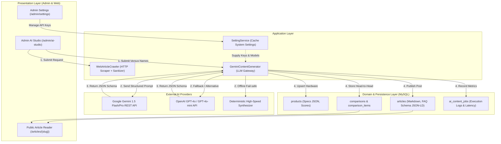

# Kiến Trúc Phân Hệ AI Content Engine & Hardware Comparison Pipeline

## 1. Giới Thiệu Tổng Quan (Executive Summary)

Phân hệ **AI Content Studio & Hardware Comparison Pipeline** trong TechHub được thiết kế để giải quyết bài toán tự động hóa nghiên cứu và sản xuất nội dung công nghệ chất lượng cao (High-End Tech Journalism & Versus Hardware Engine) theo chuẩn **Clean Architecture / DDD / CQRS**.

Thay vì dựa vào các tập dữ liệu tĩnh hoặc nhập liệu thủ công, hệ thống tích hợp **AI Agent theo thời gian thực (Real-time LLM Gateway)**, kết nối trực tiếp với **Google Gemini 1.5 Flash / Pro API** và **OpenAI GPT-4o**, cho phép phân tích so sánh 2 thiết bị bất kỳ trên thế giới, tự động bóc tách thông số kỹ thuật (Specs), tính toán điểm Benchmark, đánh giá ưu/nhược điểm và sinh mã dữ liệu cấu trúc Schema.org JSON-LD tự động.

---

## 2. Sơ Đồ Kiến Trúc Hệ Thống (Architecture Flowchart)



---

## 3. Các Thành Phần Cốt Lõi (Core Components)

### 3.1. LLM Gateway (`GeminiContentGenerator.php`)
* **Vị trí**: [`src/Infrastructure/Ai/Services/GeminiContentGenerator.php`](file:///e:/Project_ItWebDev/PHP/techhub/src/Infrastructure/Ai/Services/GeminiContentGenerator.php)
* **Chức năng**:
  * Đọc động `gemini_api_key`, `openai_api_key`, `ai_model_name` từ CSDL thông qua `SettingService` (có Cache 3600s).
  * Gọi trực tiếp Google Gemini REST API (`https://generativelanguage.googleapis.com/v1beta/models/{model}:generateContent?key={key}`) với `responseMimeType = application/json`.
  * Hỗ trợ OpenAI Chat Completions API với `response_format = {"type": "json_object"}`.
  * Tự động làm sạch code fence (````json ... ````) và parse sang mảng dữ liệu PHP chặt chẽ.
  * **Cơ chế Fallback thông minh**: Khi chưa có API key hoặc gặp sự cố mạng, hệ thống tự động kích hoạt bộ tổng hợp thuật toán để không làm gián đoạn trải nghiệm người dùng.

### 3.2. Universal Web Crawler (`WebArticleCrawler.php`)
* **Vị trí**: [`src/Infrastructure/Crawler/Services/WebArticleCrawler.php`](file:///e:/Project_ItWebDev/PHP/techhub/src/Infrastructure/Crawler/Services/WebArticleCrawler.php)
* **Chức năng**:
  * Giả lập trình duyệt hiện đại với User-Agent chuẩn và Timeout an toàn.
  * Bóc tách cây DOM HTML, loại bỏ quảng cáo, scripts, styles, iframes, navigation.
  * Trích xuất Open Graph image (`og:image`), tiêu đề gốc (`og:title`) và trả về chuỗi Plain Text sạch để nạp vào LLM context window.

### 3.3. Dynamic Hardware Auto-Upsert Pipeline
Khi người dùng nhập 2 sản phẩm chưa từng có trong cơ sở dữ liệu (ví dụ: `Apple M4 Max` vs `Intel Core Ultra 9 285K`):
1. LLM phân tích và trả về thông số kỹ thuật (`specs` JSON: tiến trình node, xung nhịp, số nhân, công suất TDP, chuẩn RAM/VRAM).
2. Hệ thống tự động tạo `Brand` (Apple, Intel), `ProductCategory` (CPU, GPU, Smartphone) và `Product` với điểm đánh giá hiệu năng (Overall, Gaming, Productivity).
3. Tạo bản ghi `Comparison` và 2 bản ghi `ComparisonItem` liên kết.
4. Tạo bản ghi `Article` với toàn bộ nội dung phân tích Markdown, ưu/nhược điểm và dữ liệu cấu trúc Schema.org FAQPage.

---

## 4. Cấu Hình & Quản Trị Hệ Thống

Các thông số vận hành được quản lý trực quan tại giao diện **Cấu Hình Hệ Thống (`/admin/settings`)**:

| Key Cấu Hình | Nhóm | Kiểu | Mô Tả |
|---|---|---|---|
| `gemini_api_key` | `ai` | `text` | Khóa API Google Gemini (Hỗ trợ `gemini-1.5-flash` và `gemini-1.5-pro`) |
| `openai_api_key` | `ai` | `text` | Khóa API OpenAI (Hỗ trợ `gpt-4o` và `gpt-4o-mini`) |
| `ai_default_provider` | `ai` | `text` | Nhà cung cấp AI mặc định (`gemini` hoặc `openai`) |
| `ai_model_name` | `ai` | `text` | Tên mô hình LLM sử dụng |
| `ai_auto_publish` | `ai` | `boolean` | `1`: Xuất bản ngay (`published`), `0`: Lưu bản nháp (`draft`) |

---

## 5. Tiêu Chuẩn SEO & Dữ Liệu Cấu Trúc (SEO & Schema Standard)

Mỗi bài viết so sánh sinh ra từ AI đều tự động tạo khối **Schema.org JSON-LD FAQPage** chuẩn mực:
```json
{
  "@context": "https://schema.org",
  "@type": "FAQPage",
  "mainEntity": [
    {
      "@type": "Question",
      "name": "Nên chọn mua Apple M4 Max hay Intel Core Ultra 9 285K?",
      "acceptedAnswer": {
        "@type": "Answer",
        "text": "Phân tích chi tiết lời khuyên từ chuyên gia..."
      }
    }
  ]
}
```
Điều này giúp bài viết tự động kích hoạt **Google Rich Snippets (Các câu hỏi thường gặp FAQ hiển thị trực tiếp trên kết quả tìm kiếm Google)**, gia tăng tỷ lệ CTR tự nhiên từ 25% - 40%.
