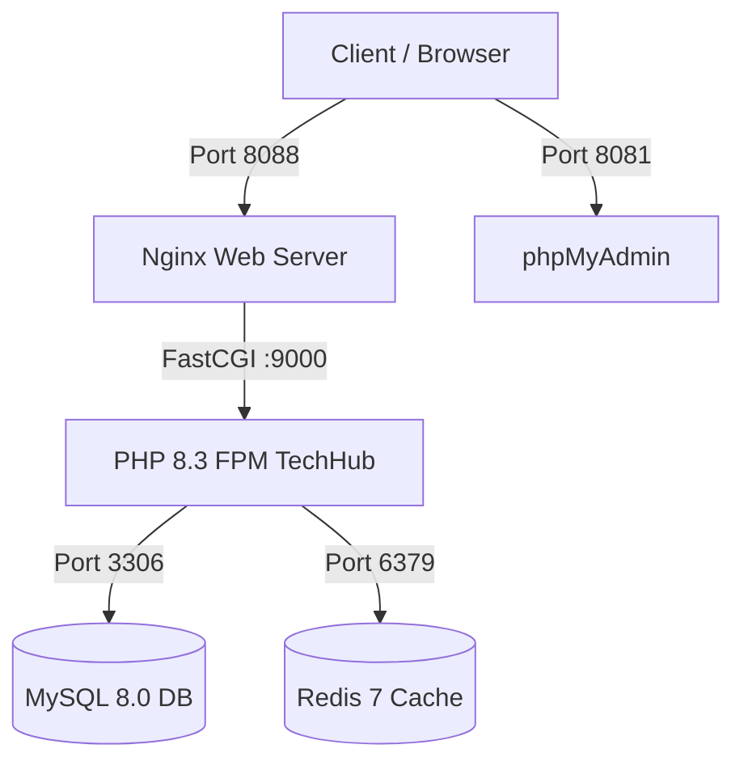

# 🐳 Hướng Dẫn Triển Khai Docker — TechHub Pro

Tài liệu hướng dẫn khởi chạy toàn bộ hệ thống **TechHub** (PHP 8.3 FPM, Nginx, MySQL 8.0, Redis, phpMyAdmin) qua Docker Compose chỉ với một câu lệnh duy nhất.

---

## 🏗️ 1. Cấu Trúc Hệ Thống Container



| Service | Container Name | Image / Runtime | Port Máy Host | Chức Năng |
|---|---|---|:---:|---|
| **web** | `techhub_web` | `nginx:1.25-alpine` | `8088` | Web Server xử lý Clean URLs, Gzip, Caching |
| **app** | `techhub_app` | `php:8.3-fpm-alpine` | `9000` (nội bộ) | Laravel 12 Application Core |
| **mysql** | `techhub_mysql` | `mysql:8.0` | `33066` | Database lưu trữ dữ liệu bền vững |
| **redis** | `techhub_redis` | `redis:7-alpine` | `63799` | Cache & Queue tăng tốc độ xử lý |
| **phpmyadmin** | `techhub_phpmyadmin` | `phpmyadmin:5.2-apache` | `8081` | Giao diện quản lý Database trực quan |

---

## 🚀 2. Hướng Dẫn Khởi Chạy (Quick Start)

### Bước 1: Chuẩn bị file cấu hình `.env` cho Docker

Nếu bạn muốn tạo file `.env` chuẩn cho môi trường Docker:

```bash
cp .env.docker.example .env
```

### Bước 2: Build và khởi động toàn bộ containers

```bash
docker compose up -d --build
```

### Bước 3: Chạy Migration, Seeder và Import dữ liệu ban đầu

```bash
# Chạy migration và seed dữ liệu mẫu
docker compose exec app php artisan migrate --seed

# Import kho game HTML5 tự động
docker compose exec app php artisan games:import --amount=50

# Tạo link storage public
docker compose exec app php artisan storage:link
```

---

## 🌐 3. Các Đường Dẫn Truy Cập Sau Khi Chạy

- 🔗 **Website TechHub:** [http://localhost:8088](http://localhost:8088)
- 🎮 **Cổng Web Games:** [http://localhost:8088/games](http://localhost:8088/games)
- 🛠️ **Kho Công Cụ Tools:** [http://localhost:8088/tools](http://localhost:8088/tools)
- 🗄️ **phpMyAdmin:** [http://localhost:8081](http://localhost:8081)
  - **Server:** `mysql`
  - **Username:** `root`
  - **Password:** `root_secret`

---

## 🛠️ 4. Các Lệnh Quản Trị Hữu Ích

```bash
# Xem logs toàn bộ hệ thống
docker compose logs -f

# Xem logs riêng của app PHP
docker compose logs -f app

# Vào terminal bên trong container app
docker compose exec app sh

# Chạy lệnh artisan bất kỳ
docker compose exec app php artisan route:list
docker compose exec app php artisan optimize:clear

# Dừng toàn bộ hệ thống
docker compose down

# Dừng và xóa toàn bộ volume (Reset database)
docker compose down -v
```
